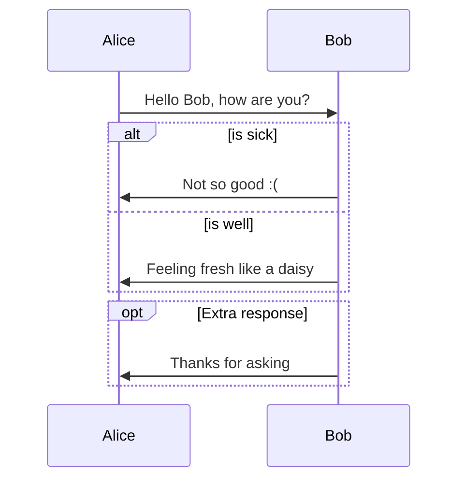
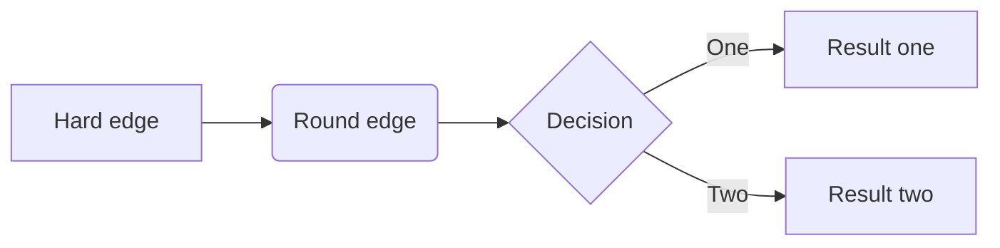
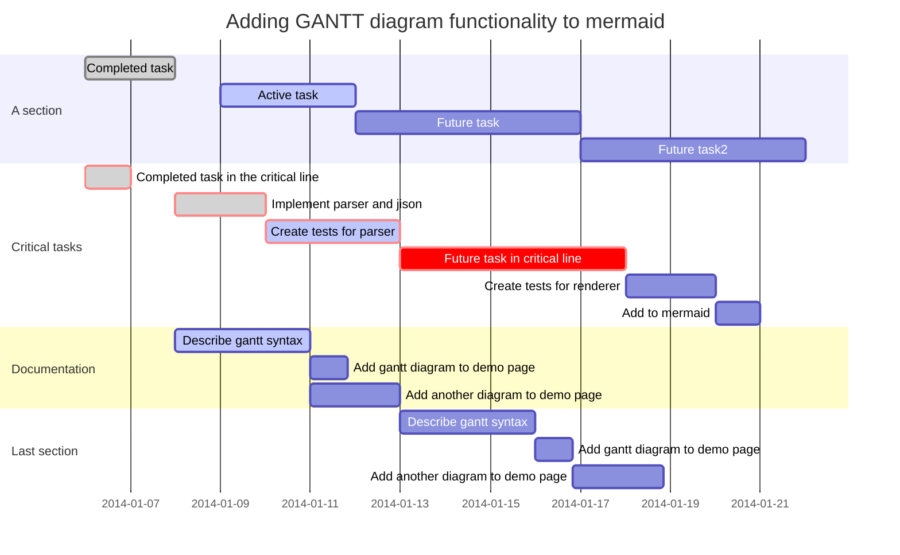
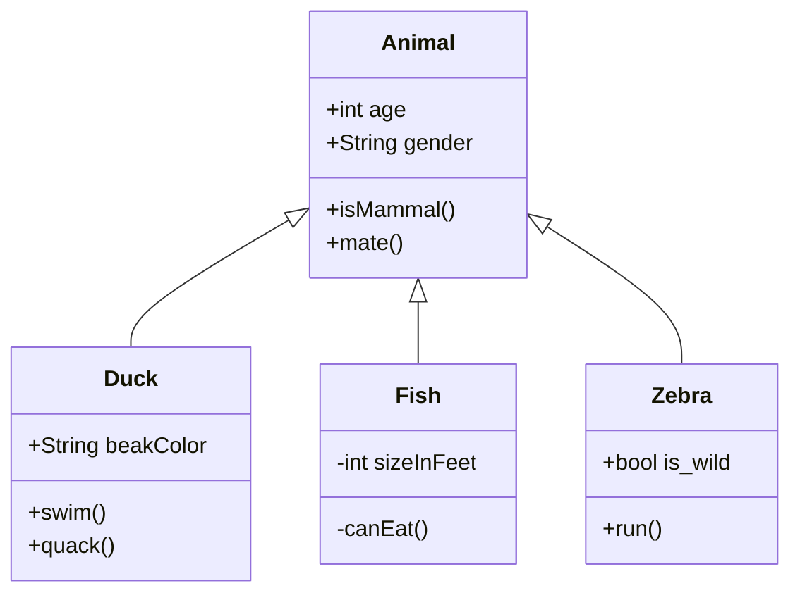
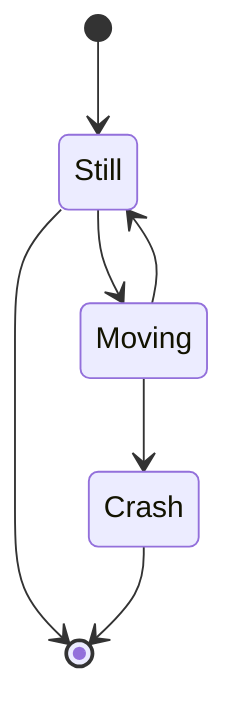
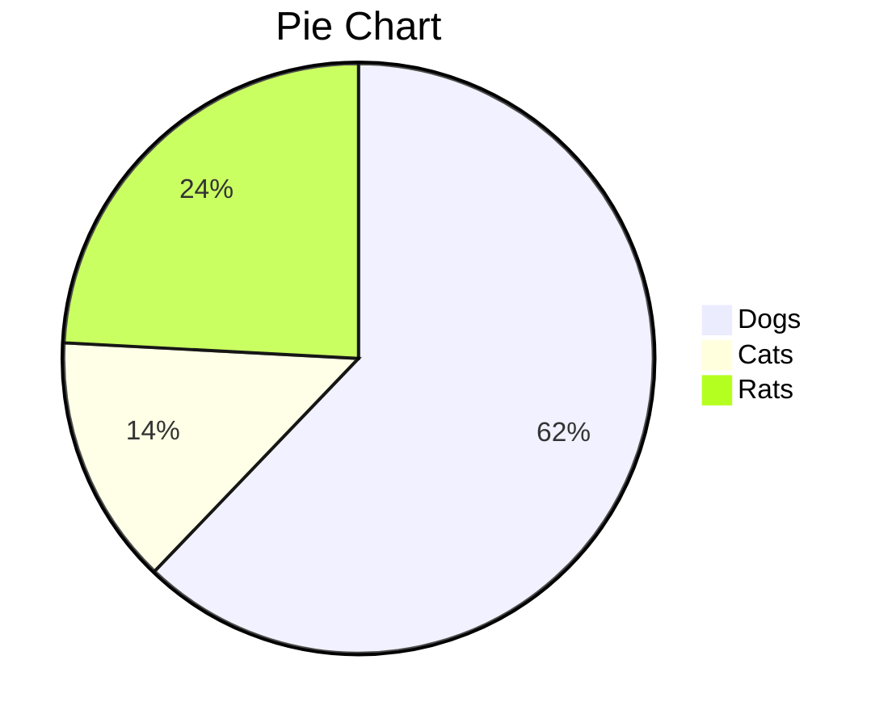

# Markdown

---

## Markdown标题

# 一级标题

## 二级标题

### 三级标题

#### 四级标题

##### 五级标题

###### 六级标题

---

## Markdown文本格式

*斜体文本*

**粗体文本**

***粗斜体文本***

~~删除线~~

<u>下划线文本</u>

上标^上标^

下标~下标~

==高亮==

创建脚注的文本[^要注明脚注的文本]

---

## Markdown列表

- 第一
+ 第二
* 第三

1. 第一
2. 第二
3. 第三


1. 第一：
   1. 嵌套一
   2. 嵌套二
2. 第二：
   - 嵌套一
   - 嵌套二

- [ ] 未完成
- [x] 已完成

---

## Markdown区块

> 最外层
> > 第一层
> >
> > > 第二层

> 区块中使用列表
>
> 1. 第一项
> 2. 第二项
>
> + 第一项
> + 第二项

* 第一项

   > 菜鸟教程
   > 学的不仅是技术而是梦想
   
* 第二项

---

## Markdown代码

使用 <kbd>Ctrl</kbd>+<kbd>Alt</kbd>+<kbd>Del</kbd> 重启电脑

`printf()`函数

```javascript
$(document).ready(function(){
                  alert('RUNOOB');
                  });
```

---

## Markdown链接

这是一个搜索引擎[必应](https://cn.bing.com/)

---

## Markdown内部引用

[点击跳转](#Markdown标题)

<a href="#Markdown标题">点击跳转</a>

---

## Markdown文件跳转

[Git教程](Git教程.md)

[我的论文](D:\归档资料\2020.09~2021.07大三个人文件\数字经济\互联网使用与性别工资差异——基于CGSS数据的分析.docx)

---

## Markdown图片


---

## Markdow表格

| 表头 | 表头 |
| ---- | ---- |
| 单元格 | 单元格 |
| 单元格 | 单元格 |

| 左对齐 | 右对齐 | 居中对齐 |
| :-----| ----: | :----: |
| 单元格 | 单元格 | 单元格 |
| 单元格 | 单元格 | 单元格 |

---

## Markdown字体设置


<center>
    居中
</center>


<p align="left">左对齐</p>

<font face="隶书">我是隶书字体</font>

<font face="黑体" size=5>我是5号字</font>

<font color=green size=5>颜色</font>

---

## Markdown数学公式

$$
\begin{Bmatrix}
   a & b \\
   c & d
\end{Bmatrix}
$$

$$
\begin{CD}
   A @>a>> B \\
@VbVV @AAcA \\
   C @= D
\end{CD}
$$


## Markdown流程图

```sequence
Alice->Bob: Hello Bob, how are you?
Note right of Bob: Bob thinks
Bob-->Alice: I am good thanks!
```

```flow
st=>start: Start
op=>operation: Your Operation
cond=>condition: Yes or No?
e=>end

st->op->cond
cond(yes)->e
cond(no)->op
```













## Markdown颜色

<table><tr><td bgcolor=#D1EEEE>背景色的设置是按照十六进制颜色值：#D1EEEE</td></tr></table>

<table><tbody>
    <tr>
        <th>颜色名</th><th>十六进制颜色值</th><th>颜色</th>
    </tr>
    <tr>
        <td><font color="AliceBlue">AliceBlue</font></td><td><font color="AliceBlue">F0F8FF</font></td><td bgcolor="AliceBlue">rgb(240, 248, 255)</td>
    </tr>
     <tr>
        <td><font color="AntiqueWhite">AntiqueWhite</font></td><td><font color="AntiqueWhite">#FAEBD7</font></td><td bgcolor="AntiqueWhite">rgb(250, 235, 215)</td>
    </tr>
      <tr>
        <td><font color="Lavender">Lavender</font></td><td><font color="Lavender">#E6E6FA</font></td><td bgcolor="Lavender">rgb(230, 230, 250)</td>
    </tr>		
    <tr>
        <td><font color="LavenderBlush">LavenderBlush</font></td><td><font color="LavenderBlush">#FFF0F5</font></td><td bgcolor="LavenderBlush">rgb(255, 240, 245)</td>
    </tr>		
     <tr>
        <td><font color=" LightPink"> LightPink</font></td><td><font color=" LightPink">#FFB6C1</font></td><td bgcolor=" LightPink">rgb(255, 182, 193)</td>
    </tr>		
     <tr>
        <td><font color="LightSalmon">LightSalmon</font></td><td><font color="LightSalmon">#FFA07A</font></td><td bgcolor="LightSalmon">rgb(255, 160, 122)</td>
    </tr>		
     <tr>
        <td><font color="MintCream">MintCream</font></td><td><font color="MintCream">#F5FFFA</font></td><td bgcolor="MintCream">rgb(245, 255, 250)</td>
    </tr>	
     <tr>
        <td><font color="MistyRose">MistyRose</font></td><td><font color="MistyRose">#FFE4E1</font></td><td bgcolor="MistyRose">rgb(255, 228, 225)</td>
    </tr>	
     <tr>
        <td><font color="Moccasin">Moccasin</font></td><td><font color="Moccasin">#FFE4B5</font></td><td bgcolor="Moccasin">rgb(255, 228, 181)</td>
    </tr>	
     <tr>
        <td><font color="MintCream">MintCream</font></td><td><font color="MintCream">#F5FFFA</font></td><td bgcolor="MintCream">rgb(245, 255, 250)</td>
    </tr>		
	 <tr>
        <td><font color="PaleVioletRed">PaleVioletRed</font></td><td><font color="PaleVioletRed">#D87093</font></td><td bgcolor="PaleVioletRed">rgb(216, 112, 147)</td>
    </tr>				
</table>
---

## Markdown表情

### People

| 😄 `:smile:`                        | 😆 `:laughing:`                     |                          |
| :--------------------------------- | :--------------------------------- | :----------------------- |
| 😊 `:blush:`                        | 😃 `:smiley:`                       | ☺️ `:relaxed:`            |
| 😏 `:smirk:`                        | 😍 `:heart_eyes:`                   | 😘 `:kissing_heart:`      |
| 😚 `:kissing_closed_eyes:`          | 😳 `:flushed:`                      | 😌 `:relieved:`           |
| 😆 `:satisfied:`                    | 😁 `:grin:`                         | 😉 `:wink:`               |
| 😜 `:stuck_out_tongue_winking_eye:` | 😝 `:stuck_out_tongue_closed_eyes:` | 😀 `:grinning:`           |
| 😗 `:kissing:`                      | 😙 `:kissing_smiling_eyes:`         | 😛 `:stuck_out_tongue:`   |
| 😴 `:sleeping:`                     | 😟 `:worried:`                      | 😦 `:frowning:`           |
| 😧 `:anguished:`                    | 😮 `:open_mouth:`                   | 😬 `:grimacing:`          |
| 😕 `:confused:`                     | 😯 `:hushed:`                       | 😑 `:expressionless:`     |
| 😒 `:unamused:`                     | 😅 `:sweat_smile:`                  | 😓 `:sweat:`              |
| 😥 `:disappointed_relieved:`        | 😩 `:weary:`                        | 😔 `:pensive:`            |
| 😞 `:disappointed:`                 | 😖 `:confounded:`                   | 😨 `:fearful:`            |
| 😰 `:cold_sweat:`                   | 😣 `:persevere:`                    | 😢 `:cry:`                |
| 😭 `:sob:`                          | 😂 `:joy:`                          | 😲 `:astonished:`         |
| 😱 `:scream:`                       |                                    | 😫 `:tired_face:`         |
| 😠 `:angry:`                        | 😡 `:rage:`                         | 😤 `:triumph:`            |
| 😪 `:sleepy:`                       | 😋 `:yum:`                          | 😷 `:mask:`               |
| 😎 `:sunglasses:`                   | 😵 `:dizzy_face:`                   | 👿 `:imp:`                |
| 😈 `:smiling_imp:`                  | 😐 `:neutral_face:`                 | 😶 `:no_mouth:`           |
| 😇 `:innocent:`                     | 👽 `:alien:`                        | 💛 `:yellow_heart:`       |
| 💙 `:blue_heart:`                   | 💜 `:purple_heart:`                 | ❤️ `:heart:`              |
| 💚 `:green_heart:`                  | 💔 `:broken_heart:`                 | 💓 `:heartbeat:`          |
| 💗 `:heartpulse:`                   | 💕 `:two_hearts:`                   | 💞 `:revolving_hearts:`   |
| 💘 `:cupid:`                        | 💖 `:sparkling_heart:`              | ✨ `:sparkles:`           |
| ⭐️ `:star:`                         | 🌟 `:star2:`                        | 💫 `:dizzy:`              |
| 💥 `:boom:`                         | 💥 `:collision:`                    | 💢 `:anger:`              |
| ❗️ `:exclamation:`                  | ❓ `:question:`                     | ❕ `:grey_exclamation:`   |
| ❔ `:grey_question:`                | 💤 `:zzz:`                          | 💨 `:dash:`               |
| 💦 `:sweat_drops:`                  | 🎶 `:notes:`                        | 🎵 `:musical_note:`       |
| 🔥 `:fire:`                         | 💩 `:hankey:`                       | 💩 `:poop:`               |
| 💩 `:shit:`                         | 👍 `:+1:`                           | 👍 `:thumbsup:`           |
| 👎 `:-1:`                           | 👎 `:thumbsdown:`                   | 👌 `:ok_hand:`            |
| 👊 `:punch:`                        | 👊 `:facepunch:`                    | ✊ `:fist:`               |
| ✌️ `:v:`                            | 👋 `:wave:`                         | ✋ `:hand:`               |
| ✋ `:raised_hand:`                  | 👐 `:open_hands:`                   | ☝️ `:point_up:`           |
| 👇 `:point_down:`                   | 👈 `:point_left:`                   | 👉 `:point_right:`        |
| 🙌 `:raised_hands:`                 | 🙏 `:pray:`                         | 👆 `:point_up_2:`         |
| 👏 `:clap:`                         | 💪 `:muscle:`                       | 🤘 `:metal:`              |
| 🖕 `:fu:`                           | 🚶 `:walking:`                      | 🏃 `:runner:`             |
| 🏃 `:running:`                      | 👫 `:couple:`                       | 👪 `:family:`             |
| 👬 `:two_men_holding_hands:`        | 👭 `:two_women_holding_hands:`      | 💃 `:dancer:`             |
| 👯 `:dancers:`                      | 🙆 `:ok_woman:`                     | 🙅 `:no_good:`            |
| 💁 `:information_desk_person:`      | 🙋 `:raising_hand:`                 | 👰 `:bride_with_veil:`    |
| 🙎 `:person_with_pouting_face:`     | 🙍 `:person_frowning:`              | 🙇 `:bow:`                |
| :couplekiss: `:couplekiss:`        | 💑 `:couple_with_heart:`            | 💆 `:massage:`            |
| 💇 `:haircut:`                      | 💅 `:nail_care:`                    | 👦 `:boy:`                |
| 👧 `:girl:`                         | 👩 `:woman:`                        | 👨 `:man:`                |
| 👶 `:baby:`                         | 👵 `:older_woman:`                  | 👴 `:older_man:`          |
| 👱 `:person_with_blond_hair:`       | 👲 `:man_with_gua_pi_mao:`          | 👳 `:man_with_turban:`    |
| 👷 `:construction_worker:`          | 👮 `:cop:`                          | 👼 `:angel:`              |
| 👸 `:princess:`                     | 😺 `:smiley_cat:`                   | 😸 `:smile_cat:`          |
| 😻 `:heart_eyes_cat:`               | 😽 `:kissing_cat:`                  | 😼 `:smirk_cat:`          |
| 🙀 `:scream_cat:`                   | 😿 `:crying_cat_face:`              | 😹 `:joy_cat:`            |
| 😾 `:pouting_cat:`                  | 👹 `:japanese_ogre:`                | 👺 `:japanese_goblin:`    |
| 🙈 `:see_no_evil:`                  | 🙉 `:hear_no_evil:`                 | 🙊 `:speak_no_evil:`      |
| 💂 `:guardsman:`                    | 💀 `:skull:`                        | 🐾 `:feet:`               |
| 👄 `:lips:`                         | 💋 `:kiss:`                         | 💧 `:droplet:`            |
| 👂 `:ear:`                          | 👀 `:eyes:`                         | 👃 `:nose:`               |
| 👅 `:tongue:`                       | 💌 `:love_letter:`                  | 👤 `:bust_in_silhouette:` |
| 👥 `:busts_in_silhouette:`          | 💬 `:speech_balloon:`               | 💭 `:thought_balloon:`    |

### Nature

| ☀️ `:sunny:`                        | ☔️ `:umbrella:`             | ☁️ `:cloud:`                       |
| :--------------------------------- | :------------------------- | :-------------------------------- |
| ❄️ `:snowflake:`                    | ⛄️ `:snowman:`              | ⚡️ `:zap:`                         |
| 🌀 `:cyclone:`                      | 🌁 `:foggy:`                | 🌊 `:ocean:`                       |
| 🐱 `:cat:`                          | 🐶 `:dog:`                  | 🐭 `:mouse:`                       |
| 🐹 `:hamster:`                      | 🐰 `:rabbit:`               | 🐺 `:wolf:`                        |
| 🐸 `:frog:`                         | 🐯 `:tiger:`                | 🐨 `:koala:`                       |
| 🐻 `:bear:`                         | 🐷 `:pig:`                  | 🐽 `:pig_nose:`                    |
| 🐮 `:cow:`                          | 🐗 `:boar:`                 | 🐵 `:monkey_face:`                 |
| 🐒 `:monkey:`                       | 🐴 `:horse:`                | 🐎 `:racehorse:`                   |
| 🐫 `:camel:`                        | 🐑 `:sheep:`                | 🐘 `:elephant:`                    |
| 🐼 `:panda_face:`                   | 🐍 `:snake:`                | 🐦 `:bird:`                        |
| 🐤 `:baby_chick:`                   | 🐥 `:hatched_chick:`        | 🐣 `:hatching_chick:`              |
| 🐔 `:chicken:`                      | 🐧 `:penguin:`              | 🐢 `:turtle:`                      |
| 🐛 `:bug:`                          | 🐝 `:honeybee:`             | 🐜 `:ant:`                         |
| 🐞 `:beetle:`                       | 🐌 `:snail:`                | 🐙 `:octopus:`                     |
| 🐠 `:tropical_fish:`                | 🐟 `:fish:`                 | 🐳 `:whale:`                       |
| 🐋 `:whale2:`                       | 🐬 `:dolphin:`              | 🐄 `:cow2:`                        |
| 🐏 `:ram:`                          | 🐀 `:rat:`                  | 🐃 `:water_buffalo:`               |
| 🐅 `:tiger2:`                       | 🐇 `:rabbit2:`              | 🐉 `:dragon:`                      |
| 🐐 `:goat:`                         | 🐓 `:rooster:`              | 🐕 `:dog2:`                        |
| 🐖 `:pig2:`                         | 🐁 `:mouse2:`               | 🐂 `:ox:`                          |
| 🐲 `:dragon_face:`                  | 🐡 `:blowfish:`             | 🐊 `:crocodile:`                   |
| 🐪 `:dromedary_camel:`              | 🐆 `:leopard:`              | 🐈 `:cat2:`                        |
| 🐩 `:poodle:`                       | 🐾 `:paw_prints:`           | 💐 `:bouquet:`                     |
| 🌸 `:cherry_blossom:`               | 🌷 `:tulip:`                | 🍀 `:four_leaf_clover:`            |
| 🌹 `:rose:`                         | 🌻 `:sunflower:`            | 🌺 `:hibiscus:`                    |
| 🍁 `:maple_leaf:`                   | 🍃 `:leaves:`               | 🍂 `:fallen_leaf:`                 |
| 🌿 `:herb:`                         | 🍄 `:mushroom:`             | 🌵 `:cactus:`                      |
| 🌴 `:palm_tree:`                    | 🌲 `:evergreen_tree:`       | 🌳 `:deciduous_tree:`              |
| 🌰 `:chestnut:`                     | 🌱 `:seedling:`             | 🌼 `:blossom:`                     |
| 🌾 `:ear_of_rice:`                  | 🐚 `:shell:`                | 🌐 `:globe_with_meridians:`        |
| 🌞 `:sun_with_face:`                | 🌝 `:full_moon_with_face:`  | 🌚 `:new_moon_with_face:`          |
| 🌑 `:new_moon:`                     | 🌒 `:waxing_crescent_moon:` | 🌓 `:first_quarter_moon:`          |
| 🌔 `:waxing_gibbous_moon:`          | 🌕 `:full_moon:`            | 🌖 `:waning_gibbous_moon:`         |
| 🌗 `:last_quarter_moon:`            | 🌘 `:waning_crescent_moon:` | 🌜 `:last_quarter_moon_with_face:` |
| 🌛 `:first_quarter_moon_with_face:` | 🌔 `:moon:`                 | 🌍 `:earth_africa:`                |
| 🌎 `:earth_americas:`               | 🌏 `:earth_asia:`           | 🌋 `:volcano:`                     |
| 🌌 `:milky_way:`                    | :partly_sunny: `:partly_sunny:`         |                                   |

### Object

| 🎍 `:bamboo:`                         | 💝 `:gift_heart:`                 | 🎎 `:dolls:`                  |
| :----------------------------------- | :------------------------------- | :--------------------------- |
| 🎒 `:school_satchel:`                 | 🎓 `:mortar_board:`               | 🎏 `:flags:`                  |
| 🎆 `:fireworks:`                      | 🎇 `:sparkler:`                   | 🎐 `:wind_chime:`             |
| 🎑 `:rice_scene:`                     | 🎃 `:jack_o_lantern:`             | 👻 `:ghost:`                  |
| 🎅 `:santa:`                          | 🎄 `:christmas_tree:`             | 🎁 `:gift:`                   |
| 🔔 `:bell:`                           | 🔕 `:no_bell:`                    | 🎋 `:tanabata_tree:`          |
| 🎉 `:tada:`                           | 🎊 `:confetti_ball:`              | 🎈 `:balloon:`                |
| 🔮 `:crystal_ball:`                   | 💿 `:cd:`                         | 📀 `:dvd:`                    |
| 💾 `:floppy_disk:`                    | 📷 `:camera:`                     | 📹 `:video_camera:`           |
| 🎥 `:movie_camera:`                   | 💻 `:computer:`                   | 📺 `:tv:`                     |
| 📱 `:iphone:`                         | ☎️ `:phone:`                      | ☎️ `:telephone:`              |
| 📞 `:telephone_receiver:`             | 📟 `:pager:`                      | 📠 `:fax:`                    |
| 💽 `:minidisc:`                       | 📼 `:vhs:`                        | 🔉 `:sound:`                  |
| 🔈 `:speaker:`                        | 🔇 `:mute:`                       | 📢 `:loudspeaker:`            |
| 📣 `:mega:`                           | ⌛️ `:hourglass:`                  | ⏳ `:hourglass_flowing_sand:` |
| ⏰ `:alarm_clock:`                    | ⌚️ `:watch:`                      | 📻 `:radio:`                  |
| 📡 `:satellite:`                      | ➿ `:loop:`                       | 🔍 `:mag:`                    |
| 🔎 `:mag_right:`                      | 🔓 `:unlock:`                     | 🔒 `:lock:`                   |
| 🔏 `:lock_with_ink_pen:`              | 🔐 `:closed_lock_with_key:`       | 🔑 `:key:`                    |
| 💡 `:bulb:`                           | 🔦 `:flashlight:`                 | 🔆 `:high_brightness:`        |
| 🔅 `:low_brightness:`                 | 🔌 `:electric_plug:`              | 🔋 `:battery:`                |
| 📲 `:calling:`                        | ✉️ `:email:`                      | 📫 `:mailbox:`                |
| 📮 `:postbox:`                        | 🛀 `:bath:`                       | 🛁 `:bathtub:`                |
| 🚿 `:shower:`                         | 🚽 `:toilet:`                     | 🔧 `:wrench:`                 |
| 🔩 `:nut_and_bolt:`                   | 🔨 `:hammer:`                     | 💺 `:seat:`                   |
| 💰 `:moneybag:`                       | 💴 `:yen:`                        | 💵 `:dollar:`                 |
| 💷 `:pound:`                          | 💶 `:euro:`                       | 💳 `:credit_card:`            |
| 💸 `:money_with_wings:`               | 📧 `:e-mail:`                     | 📥 `:inbox_tray:`             |
| 📤 `:outbox_tray:`                    | ✉️ `:envelope:`                   | 📨 `:incoming_envelope:`      |
| 📯 `:postal_horn:`                    | 📪 `:mailbox_closed:`             | 📬 `:mailbox_with_mail:`      |
| 📭 `:mailbox_with_no_mail:`           | 🚪 `:door:`                       | 🚬 `:smoking:`                |
| 💣 `:bomb:`                           | 🔫 `:gun:`                        | 🔪 `:hocho:`                  |
| 💊 `:pill:`                           | 💉 `:syringe:`                    | 📄 `:page_facing_up:`         |
| 📃 `:page_with_curl:`                 | 📑 `:bookmark_tabs:`              | 📊 `:bar_chart:`              |
| 📈 `:chart_with_upwards_trend:`       | 📉 `:chart_with_downwards_trend:` | 📜 `:scroll:`                 |
| 📋 `:clipboard:`                      | 📆 `:calendar:`                   | 📅 `:date:`                   |
| 📇 `:card_index:`                     | 📁 `:file_folder:`                | 📂 `:open_file_folder:`       |
| ✂️ `:scissors:`                       | 📌 `:pushpin:`                    | 📎 `:paperclip:`              |
| ✒️ `:black_nib:`                      | ✏️ `:pencil2:`                    | 📏 `:straight_ruler:`         |
| 📐 `:triangular_ruler:`               | 📕 `:closed_book:`                | 📗 `:green_book:`             |
| 📘 `:blue_book:`                      | 📙 `:orange_book:`                | 📓 `:notebook:`               |
| 📔 `:notebook_with_decorative_cover:` | 📒 `:ledger:`                     | 📚 `:books:`                  |
| 🔖 `:bookmark:`                       | 📛 `:name_badge:`                 | 🔬 `:microscope:`             |
| 🔭 `:telescope:`                      | 📰 `:newspaper:`                  | 🏈 `:football:`               |
| 🏀 `:basketball:`                     | ⚽️ `:soccer:`                     | ⚾️ `:baseball:`               |
| 🎾 `:tennis:`                         | 🎱 `:8ball:`                      | 🏉 `:rugby_football:`         |
| 🎳 `:bowling:`                        | ⛳️ `:golf:`                       | 🚵 `:mountain_bicyclist:`     |
| 🚴 `:bicyclist:`                      | 🏇 `:horse_racing:`               | 🏂 `:snowboarder:`            |
| 🏊 `:swimmer:`                        | 🏄 `:surfer:`                     | 🎿 `:ski:`                    |
| ♠️ `:spades:`                         | ♥️ `:hearts:`                     | ♣️ `:clubs:`                  |
| ♦️ `:diamonds:`                       | 💎 `:gem:`                        | 💍 `:ring:`                   |
| 🏆 `:trophy:`                         | 🎼 `:musical_score:`              | 🎹 `:musical_keyboard:`       |
| 🎻 `:violin:`                         | 👾 `:space_invader:`              | 🎮 `:video_game:`             |
| 🃏 `:black_joker:`                    | 🎴 `:flower_playing_cards:`       | 🎲 `:game_die:`               |
| 🎯 `:dart:`                           | 🀄️ `:mahjong:`                    | 🎬 `:clapper:`                |
| 📝 `:memo:`                           | 📝 `:pencil:`                     | 📖 `:book:`                   |
| 🎨 `:art:`                            | 🎤 `:microphone:`                 | 🎧 `:headphones:`             |
| 🎺 `:trumpet:`                        | 🎷 `:saxophone:`                  | 🎸 `:guitar:`                 |
| 👞 `:shoe:`                           | 👡 `:sandal:`                     | 👠 `:high_heel:`              |
| 💄 `:lipstick:`                       | 👢 `:boot:`                       | 👕 `:shirt:`                  |
| 👕 `:tshirt:`                         | 👔 `:necktie:`                    | 👚 `:womans_clothes:`         |
| 👗 `:dress:`                          | 🎽 `:running_shirt_with_sash:`    | 👖 `:jeans:`                  |
| 👘 `:kimono:`                         | 👙 `:bikini:`                     | 🎀 `:ribbon:`                 |
| 🎩 `:tophat:`                         | 👑 `:crown:`                      | 👒 `:womans_hat:`             |
| 👞 `:mans_shoe:`                      | 🌂 `:closed_umbrella:`            | 💼 `:briefcase:`              |
| 👜 `:handbag:`                        | 👝 `:pouch:`                      | 👛 `:purse:`                  |
| 👓 `:eyeglasses:`                     | 🎣 `:fishing_pole_and_fish:`      | ☕️ `:coffee:`                 |
| 🍵 `:tea:`                            | 🍶 `:sake:`                       | 🍼 `:baby_bottle:`            |
| 🍺 `:beer:`                           | 🍻 `:beers:`                      | 🍸 `:cocktail:`               |
| 🍹 `:tropical_drink:`                 | 🍷 `:wine_glass:`                 | 🍴 `:fork_and_knife:`         |
| 🍕 `:pizza:`                          | 🍔 `:hamburger:`                  | 🍟 `:fries:`                  |
| 🍗 `:poultry_leg:`                    | 🍖 `:meat_on_bone:`               | 🍝 `:spaghetti:`              |
| 🍛 `:curry:`                          | 🍤 `:fried_shrimp:`               | 🍱 `:bento:`                  |
| 🍣 `:sushi:`                          | 🍥 `:fish_cake:`                  | 🍙 `:rice_ball:`              |
| 🍘 `:rice_cracker:`                   | 🍚 `:rice:`                       | 🍜 `:ramen:`                  |
| 🍲 `:stew:`                           | 🍢 `:oden:`                       | 🍡 `:dango:`                  |
| 🥚 `:egg:`                            | 🍞 `:bread:`                      | 🍩 `:doughnut:`               |
| 🍮 `:custard:`                        | 🍦 `:icecream:`                   | 🍨 `:ice_cream:`              |
| 🍧 `:shaved_ice:`                     | 🎂 `:birthday:`                   | 🍰 `:cake:`                   |
| 🍪 `:cookie:`                         | 🍫 `:chocolate_bar:`              | 🍬 `:candy:`                  |
| 🍭 `:lollipop:`                       | 🍯 `:honey_pot:`                  | 🍎 `:apple:`                  |
| 🍏 `:green_apple:`                    | 🍊 `:tangerine:`                  | 🍋 `:lemon:`                  |
| 🍒 `:cherries:`                       | 🍇 `:grapes:`                     | 🍉 `:watermelon:`             |
| 🍓 `:strawberry:`                     | 🍑 `:peach:`                      | 🍈 `:melon:`                  |
| 🍌 `:banana:`                         | 🍐 `:pear:`                       | 🍍 `:pineapple:`              |
| 🍠 `:sweet_potato:`                   | 🍆 `:eggplant:`                   | 🍅 `:tomato:`                 |
| 🌽 `:corn:`                           |                                  |                              |

### Places

| 🏠 `:house:`               | 🏡 `:house_with_garden:`       | 🏫 `:school:`                 |
| :------------------------ | :---------------------------- | :--------------------------- |
| 🏢 `:office:`              | 🏣 `:post_office:`             | 🏥 `:hospital:`               |
| 🏦 `:bank:`                | 🏪 `:convenience_store:`       | 🏩 `:love_hotel:`             |
| 🏨 `:hotel:`               | 💒 `:wedding:`                 | ⛪️ `:church:`                 |
| 🏬 `:department_store:`    | 🏤 `:european_post_office:`    | 🌇 `:city_sunrise:`           |
| 🌆 `:city_sunset:`         | 🏯 `:japanese_castle:`         | 🏰 `:european_castle:`        |
| ⛺️ `:tent:`                | 🏭 `:factory:`                 | 🗼 `:tokyo_tower:`            |
| 🗾 `:japan:`               | 🗻 `:mount_fuji:`              | 🌄 `:sunrise_over_mountains:` |
| 🌅 `:sunrise:`             | 🌠 `:stars:`                   | 🗽 `:statue_of_liberty:`      |
| 🌉 `:bridge_at_night:`     | 🎠 `:carousel_horse:`          | 🌈 `:rainbow:`                |
| 🎡 `:ferris_wheel:`        | ⛲️ `:fountain:`                | 🎢 `:roller_coaster:`         |
| 🚢 `:ship:`                | 🚤 `:speedboat:`               | ⛵️ `:boat:`                   |
| ⛵️ `:sailboat:`            | 🚣 `:rowboat:`                 | ⚓️ `:anchor:`                 |
| 🚀 `:rocket:`              | ✈️ `:airplane:`                | 🚁 `:helicopter:`             |
| 🚂 `:steam_locomotive:`    | 🚊 `:tram:`                    | 🚞 `:mountain_railway:`       |
| 🚲 `:bike:`                | 🚡 `:aerial_tramway:`          | 🚟 `:suspension_railway:`     |
| 🚠 `:mountain_cableway:`   | 🚜 `:tractor:`                 | 🚙 `:blue_car:`               |
| 🚘 `:oncoming_automobile:` | 🚗 `:car:`                     | 🚗 `:red_car:`                |
| 🚕 `:taxi:`                | 🚖 `:oncoming_taxi:`           | 🚛 `:articulated_lorry:`      |
| 🚌 `:bus:`                 | 🚍 `:oncoming_bus:`            | 🚨 `:rotating_light:`         |
| 🚓 `:police_car:`          | 🚔 `:oncoming_police_car:`     | 🚒 `:fire_engine:`            |
| 🚑 `:ambulance:`           | 🚐 `:minibus:`                 | 🚚 `:truck:`                  |
| 🚋 `:train:`               | 🚉 `:station:`                 | 🚆 `:train2:`                 |
| 🚅 `:bullettrain_front:`   | 🚄 `:bullettrain_side:`        | 🚈 `:light_rail:`             |
| 🚝 `:monorail:`            | 🚃 `:railway_car:`             | 🚎 `:trolleybus:`             |
| 🎫 `:ticket:`              | ⛽️ `:fuelpump:`                | 🚦 `:vertical_traffic_light:` |
| 🚥 `:traffic_light:`       | ⚠️ `:warning:`                 | 🚧 `:construction:`           |
| 🔰 `:beginner:`            | 🏧 `:atm:`                     | 🎰 `:slot_machine:`           |
| 🚏 `:busstop:`             | 💈 `:barber:`                  | ♨️ `:hotsprings:`             |
| 🏁 `:checkered_flag:`      | 🎌 `:crossed_flags:`           | 🏮 `:izakaya_lantern:`        |
| 🗿 `:moyai:`               | 🎪 `:circus_tent:`             | 🎭 `:performing_arts:`        |
| 📍 `:round_pushpin:`       | 🚩 `:triangular_flag_on_post:` | 🇯🇵 `:jp:`                    |
| 🇰🇷 `:kr:`                 | 🇨🇳 `:cn:`                     | 🇺🇸 `:us:`                    |
| 🇫🇷 `:fr:`                 | 🇪🇸 `:es:`                     | 🇮🇹 `:it:`                    |
| 🇷🇺 `:ru:`                 | 🇬🇧 `:gb:`                     | 🇬🇧 `:uk:`                    |
| 🇩🇪 `:de:`                 |                               |                              |

### Symbols

| 1️⃣ `:one:`                            | 2️⃣ `:two:`                        | 3️⃣ `:three:`                     |
| :----------------------------------- | :------------------------------- | :------------------------------ |
| 4️⃣ `:four:`                           | 5️⃣ `:five:`                       | 6️⃣ `:six:`                       |
| 7️⃣ `:seven:`                          | 8️⃣ `:eight:`                      | 9️⃣ `:nine:`                      |
| 🔟 `:keycap_ten:`                     | 🔢 `:1234:`                       | 0️⃣ `:zero:`                      |
| #️⃣ `:hash:`                           | 🔣 `:symbols:`                    | ◀️ `:arrow_backward:`            |
| ⬇️ `:arrow_down:`                     | ▶️ `:arrow_forward:`              | ⬅️ `:arrow_left:`                |
| 🔠 `:capital_abcd:`                   | 🔡 `:abcd:`                       | 🔤 `:abc:`                       |
| ↙️ `:arrow_lower_left:`               | ↘️ `:arrow_lower_right:`          | ➡️ `:arrow_right:`               |
| ⬆️ `:arrow_up:`                       | ↖️ `:arrow_upper_left:`           | ↗️ `:arrow_upper_right:`         |
| ⏬ `:arrow_double_down:`              | ⏫ `:arrow_double_up:`            | 🔽 `:arrow_down_small:`          |
| ⤵️ `:arrow_heading_down:`             | ⤴️ `:arrow_heading_up:`           | ↩️`:leftwards_arrow_with_hook:`  |
| ↪️ `:arrow_right_hook:`               | ↔️ `:left_right_arrow:`           | ↕️ `:arrow_up_down:`             |
| 🔼 `:arrow_up_small:`                 | 🔃 `:arrows_clockwise:`           | 🔄 `:arrows_counterclockwise:`   |
| ⏪ `:rewind:`                         | ⏩ `:fast_forward:`               | ℹ️ `:information_source:`        |
| 🆗 `:ok:`                             | 🔀 `:twisted_rightwards_arrows:`  | 🔁 `:repeat:`                    |
| 🔂 `:repeat_one:`                     | 🆕 `:new:`                        | 🔝 `:top:`                       |
| 🆙 `:up:`                             | 🆒 `:cool:`                       | 🆓 `:free:`                      |
| 🆖 `:ng:`                             | 🎦 `:cinema:`                     | 🈁 `:koko:`                      |
| 📶 `:signal_strength:`                | 🈹 `:u5272:`                      | 🈴 `:u5408:`                     |
| 🈺 `:u55b6:`                          | 🈯️ `:u6307:`                      | 🈷️ `:u6708:`                     |
| 🈶 `:u6709:`                          | 🈵 `:u6e80:`                      | 🈚️ `:u7121:`                     |
| 🈸 `:u7533:`                          | 🈳 `:u7a7a:`                      | 🈲 `:u7981:`                     |
| 🈂️ `:sa:`                             | 🚻 `:restroom:`                   | 🚹 `:mens:`                      |
| 🚺 `:womens:`                         | 🚼 `:baby_symbol:`                | 🚭 `:no_smoking:`                |
| 🅿️ `:parking:`                        | ♿️ `:wheelchair:`                 | 🚇 `:metro:`                     |
| 🛄 `:baggage_claim:`                  | 🉑 `:accept:`                     | 🚾 `:wc:`                        |
| 🚰 `:potable_water:`                  | 🚮 `:put_litter_in_its_place:`    | ㊙️ `:secret:`                   |
| ㊗️ `:congratulations:`               | Ⓜ️ `:m:`                          | 🛂 `:passport_control:`          |
| 🛅 `:left_luggage:`                   | 🛃 `:customs:`                    | 🉐 `:ideograph_advantage:`       |
| 🆑 `:cl:`                             | 🆘 `:sos:`                        | 🆔 `:id:`                        |
| 🚫 `:no_entry_sign:`                  | 🔞 `:underage:`                   | 📵 `:no_mobile_phones:`          |
| 🚯 `:do_not_litter:`                  | 🚱 `:non-potable_water:`          | 🚳 `:no_bicycles:`               |
| 🚷 `:no_pedestrians:`                 | 🚸 `:children_crossing:`          | ⛔️ `:no_entry:`                  |
| ✳️ `:eight_spoked_asterisk:`          | ✴️ `:eight_pointed_black_star:`   | 💟 `:heart_decoration:`          |
| 🆚 `:vs:`                             | 📳 `:vibration_mode:`             | 📴 `:mobile_phone_off:`          |
| 💹 `:chart:`                          | 💱 `:currency_exchange:`          | ♈️ `:aries:`                     |
| ♉️ `:taurus:`                         | ♊️ `:gemini:`                     | ♋️ `:cancer:`                    |
| ♌️ `:leo:`                            | ♍️ `:virgo:`                      | ♎️ `:libra:`                     |
| ♏️ `:scorpius:`                       | ♐️ `:sagittarius:`                | ♑️ `:capricorn:`                 |
| ♒️ `:aquarius:`                       | ♓️ `:pisces:`                     | ⛎ `:ophiuchus:`                 |
| 🔯 `:six_pointed_star:`               | ❎`:negative_squared_cross_mark:` | 🅰️ `:a:`                         |
| 🅱️ `:b:`                              | 🆎 `:ab:`                         | 🅾️ `:o2:`                        |
| 💠`:diamond_shape_with_a_dot_inside:` | ♻️ `:recycle:`                    | 🔚 `:end:`                       |
| 🔛 `:on:`                             | 🔜 `:soon:`                       | 🕐 `:clock1:`                    |
| 🕜 `:clock130:`                       | 🕙 `:clock10:`                    | 🕥 `:clock1030:`                 |
| 🕚 `:clock11:`                        | 🕦 `:clock1130:`                  | 🕛 `:clock12:`                   |
| 🕧 `:clock1230:`                      | 🕑 `:clock2:`                     | 🕝 `:clock230:`                  |
| 🕒 `:clock3:`                         | 🕞 `:clock330:`                   | 🕓 `:clock4:`                    |
| 🕟 `:clock430:`                       | 🕔 `:clock5:`                     | 🕠 `:clock530:`                  |
| 🕕 `:clock6:`                         | 🕡 `:clock630:`                   | 🕖 `:clock7:`                    |
| 🕢 `:clock730:`                       | 🕗 `:clock8:`                     | 🕣 `:clock830:`                  |
| 🕘 `:clock9:`                         | 🕤 `:clock930:`                   | 💲 `:heavy_dollar_sign:`         |
| ©️ `:copyright:`                      | ®️ `:registered:`                 | ™️ `:tm:`                        |
| ❌ `:x:`                              | ❗️ `:heavy_exclamation_mark:`     | ‼️ `:bangbang:`                  |
| ⁉️ `:interrobang:`                    | ⭕️ `:o:`                          | ✖️ `:heavy_multiplication_x:`    |
| ➕ `:heavy_plus_sign:`                | ➖ `:heavy_minus_sign:`           | ➗ `:heavy_division_sign:`       |
| 💮 `:white_flower:`                   | 💯 `:100:`                        | ✔️ `:heavy_check_mark:`          |
| ☑️ `:ballot_box_with_check:`          | 🔘 `:radio_button:`               | 🔗 `:link:`                      |
| ➰ `:curly_loop:`                     | 〰️ `:wavy_dash:`                 | 〽️ `:part_alternation_mark:`    |
| 🔱 `:trident:`                        | :black_square: `:black_square:`  | :white_square: `:white_square:` |
| ✅ `:white_check_mark:`               | 🔲 `:black_square_button:`        | 🔳 `:white_square_button:`       |
| ⚫️ `:black_circle:`                   | ⚪️ `:white_circle:`               | 🔴 `:red_circle:`                |
| 🔵 `:large_blue_circle:`              | 🔷 `:large_blue_diamond:`         | 🔶 `:large_orange_diamond:`      |
| 🔹 `:small_blue_diamond:`             | 🔸 `:small_orange_diamond:`       | 🔺 `:small_red_triangle:`        |
| 🔻 `:small_red_triangle_down:`        |                                  |                                 |

## Markdown特殊用法

\*\* 正常显示星号 \*\*
